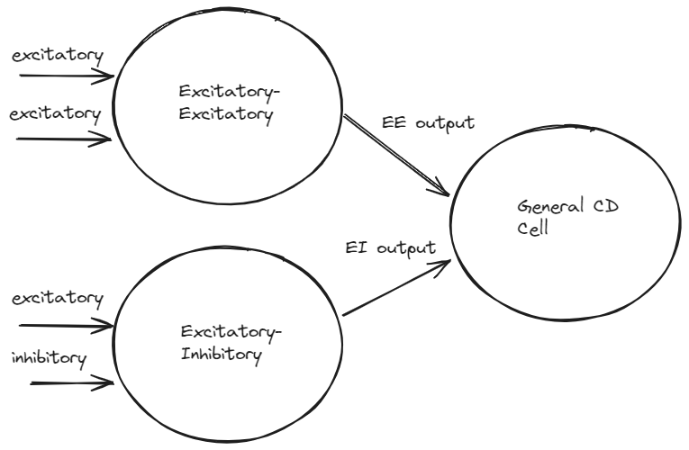

# CD-Network

CD-Network is a Python library designed for the analytical derivation of the stochastic output (*instantaneous rate*) of coincidence detection 
(CD) neurons.



[Notes](notes.pdf)

## Features

Each cell can run individually through its respective function (ei, simple_ee, ee, cd), or be configured via a network
file to connect in a chosen sequence.

### Dynamic Connections (CD Network)

Define how cells are interconnected within the network and how external inputs affect cell
responses.

```python
import numpy as np
from cd_network.network import CDNetwork

if __name__ == '__main__':
    # Load the neural network configuration from a JSON file
    config_path = r'config.json'  # Path to the configuration file
    network = CDNetwork(config_path)

    # Define external inputs for the network
    external_inputs = {
        'external1': np.random.randn(1000),
        'external2': np.random.randn(1000),
        'external3': np.random.randn(1000)
    }

    # Run the network with the provided external inputs
    outputs = network(external_inputs)

    # Print the outputs of the network
    print(outputs)

```

To visualize the network's connections, use:
```python
network.plot_network_connections()
```

### Configuration File

The CD network simulation uses a JSON configuration file. Below is a breakdown of the configuration structure:

    fs: Sampling frequency in Hz. This value is used across all cells for time-based calculations.

    cells: An array of objects where each object represents a neural cell and its specific parameters:
        type: Specifies the type of the cell (e.g., ei, simple_ee, cd).
        id: A unique identifier for the cell.
        params: Parameters specific to the cell type, such as delta_s for the time window in seconds and n_spikes for the minimum number of spikes required.

    connections: An array defining the connections between cells or from external inputs to cells:
        source: Identifier for the source of the input. This can be an external source or another cell.
        target: Identifier for the cell receiving the input.
        input_type: Specifies whether the input is excitatory or inhibitory.

[Example Configuration File](example_notebooks/config.json)

### CD Cells

#### `ei(excitatory_input, inhibitory_inputs, delta_s, fs)`

Computes the output of an excitatory-inhibitory (EI) neuron model.
The model outputs spikes based on the excitatory inputs, except when inhibited by any preceding spikes within a
specified time window from the inhibitory inputs.

- **Parameters:**
    - `excitatory_input (np.ndarray)`: 1D array of spike times or binary spikes from the excitatory neuron.
    - `inhibitory_inputs (np.ndarray)`: 1D or 2D array of spike times or binary spikes from one or more inhibitory
      neurons.
    - `delta_s (float)`: Coincidence integration duration in seconds, defining the time window for inhibition.
    - `fs (float)`: Sampling frequency in Hz.

- **Returns:**
    - `np.ndarray`: Output spike times or binary spike array after applying the excitatory-inhibitory interaction.

#### `simple_ee(inputs, delta_s, fs)`

Simplifies the model of excitatory-excitatory (EE) interaction where an output spike is generated whenever both inputs
spike within a specified time interval.

- **Parameters:**
    - `inputs (np.ndarray)`: 2D array of excitatory input spikes.
    - `delta_s (float)`: Coincidence integration duration in seconds.
    - `fs (float)`: Sampling frequency in Hz.

- **Returns:**
    - `np.ndarray`: Output spike times or binary spike array after applying the EE interaction.

#### `ee(inputs, n_spikes, delta_s, fs)`

A general excitatory-excitatory (EE) cell model that generates a spike whenever at least a minimum number of its inputs
spike simultaneously within a specific time interval.

- **Parameters:**
    - `inputs (np.ndarray)`: 2D array of excitatory input spikes.
    - `n_spikes (int)`: Minimum number of inputs that must spike simultaneously.
    - `delta_s (float)`: Coincidence integration duration in seconds.
    - `fs (float)`: Sampling frequency in Hz.

- **Returns:**
    - `np.ndarray`: Output spike times or binary spike array based on the input conditions.

#### `cd(excitatory_inputs, inhibitory_inputs, n_spikes, delta_s, fs)`

Models the output of a coincidence detector (CD) cell which generates spikes based on the relative timing and number of
excitatory and inhibitory inputs within a defined interval.

- **Parameters:**
    - `excitatory_inputs (np.ndarray)`: 2D array of excitatory input spikes.
    - `inhibitory_inputs (np.ndarray)`: 2D array of inhibitory input spikes.
    - `n_spikes (int)`: Minimum excess of excitatory spikes over inhibitory spikes required to generate an output spike.
    - `delta_s (float)`: Interval length in seconds.
    - `fs (float)`: Sampling frequency in Hz.

- **Returns:**
    - `np.ndarray`: Output spike array after applying the CD interaction based on the relative timing and number of
      inputs.

## Installation

You can install CD-Network directly from pypi:

```bash
pip install cd_network
```

Or you can install CD-Network directly from the source code:

```bash
git clone https://github.com/nuniz/CoincidenceDetectionNetwork.git
cd CoincidenceDetectionNetwork
pip install .
```

## Contribution

run pre-commit to check all files in the repo.

```bash 
pre-commit run --all-files
```

## Reference

Krips R, Furst M. Stochastic properties of auditory brainstem coincidence detectors in binaural perception.
J Acoust Soc Am. 2009 Mar;125(3):1567-83. doi: 10.1121/1.3068446. PMID: 19275315.